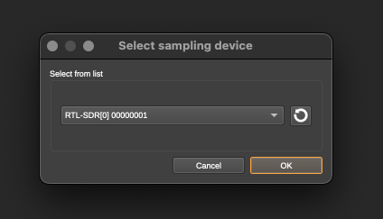

# Installion and testing yrou software-defined radio

Physcially installing your software-defined radio is super easy. Just attach a cable and an antenna to the SMA connector on one end and shove the USB end into your laptop. Details on the antenna bit will be covered a bit later. For now, just plug in the SDR.

## Installing the RTL-SDR drivers

These drivers allow your computer to talk to the SDR. And they provide lots of interesting command-line tools to boot. You'll need this to do, well, anything with your SDR.

### Installing for Linux

```bash
sudo apt update
sudo apt install rtl-sdr
```

### Installing for Mac

```bash
brew install rtl-sdr
```

### Installing for Windows

You can download the RTL SDR drivers and tools from https://ftp.osmocom.org/binaries/windows/rtl-sdr/. They are built weekly so get the latest one for your platform—probably the 64-bit one. The download is simply a .ZIP file full of .EXE and .DLL files. Put these files in a folder somewhere on your system and add that folder to your PATH to get it working.

Details on the drivers themselves can be found at https://osmocom.org/projects/rtl-sdr/wiki/Rtl-sdr.

### Testing the drivers

Regardless of your platform, testing is the same. Plug in your SDR and run the following command:

```bash
rtl_test
```

You should get back something like:

```
Found 1 device(s):
 0:  Realtek, RTL2838UHIDIR, SN: 00000001

Using device 0: Generic RTL2832U OEM
Detached kernel driver
Found Rafael Micro R820T tuner
Supported gain values (29): 0.0 0.9 1.4 2.7 3.7 7.7 8.7 12.5 14.4 15.7 16.6 19.7 20.7 22.9 25.4 28.0 29.7 32.8 33.8 36.4 37.2 38.6 40.2 42.1 43.4 43.9 44.5 48.0 49.6
[R82XX] PLL not locked!
Sampling at 2048000 S/s.

Info: This tool will continuously read from the device, and report if
samples get lost. If you observe no further output, everything is fine.

Reading samples in async mode...
Allocating 15 zero-copy buffers
lost at least 12 bytes
```

Hooray! Your drivers are working. Press Ctrl-C to stop and go to the next step.

## Listening to the weather forecase

Now that we have an SDR installed, we're going to use the SDR to listen to the weather radio!

First things first, hook up an antenna to that radio. Set it up vertically, like in the picture below. This particular style of antenna is called a dipole.


In the U.S., NOAA weather radio transmits on channels between 162.400 MHz and 162.550 MHz which have a wavelength of about 6 feet. Ideally, we want each leg of our dipole to be about 1/4 of that, or 18 inches. So extend the legs accordingly. But, don't worry. It doesn't need to be perfect and your guesstimate will do just fine.

You'll also need software. We're going to use SDRangel. Go to https://www.sdrangel.org/, click the big button labeled **Free Download**, and download a version for your platform. Once it's installed, run it.

### Connect to the SDR

At the top of SDRangel, click the icon below to attach to your SDR.


This will give you a dialog. Select the item names something like RTL-SDR with a bunch of numbers that are usually zeros like in the image below.



You will be presenting with two windows. The first window let's you control the SDR. We'll call it the control panel.


You'll want to adjust the gain slider (1) most of the way up. You'll want to click the button labeled "DC" (2). And, finally, you can click the play button (3) to start streaming data from the SDR.

You should immediately see some activity in the other window, which displays your waterfall. On the waterfall, the X-axis shows frequency, the Y-axis shows time, and the intensity of the color shows signal strength. You're probably seeing a bunch of static.


Adjust the tuner in the first window to a frequency that is actually transmitting something. You can find the specific frequency that NOAA broasdcasts on in your area using [this map](https://www.weather.gov/nwr/Maps) on their website. If you are in a large metropolitan area, it's usually 162.550 MHZ. As soon as you do, you should see a signal in the waterfall.


To actually listen to that signal, you need to open a demodulator. Do that by clicking the icon below on the control panel.


And then selecting NFM Demodulator from the drop down (which stands for narrow-band FM (which stands for frequency modulation)) and click Apply.


As soon as you do this, you should start hearing the radio broadcast.


Congratulations. You just listened to the radio with extra steps!
